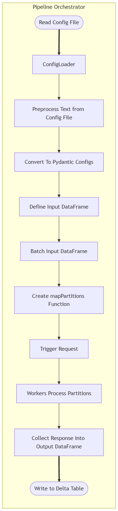
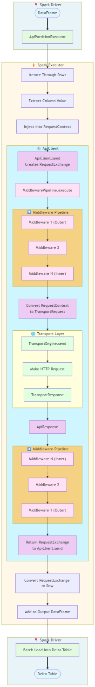

# Spark API‑Driven ETL Framework

A production‑grade, **configuration‑driven Spark ETL application** for ingesting data from files or tables, transforming it through Spark, and delivering records to external HTTP APIs at scale using Spark's parallelism. This application allows for configurable and dynamic input to provide a platform
for making API requests to any RESTfull API endpoint. The design is opinionated by defining a sink table which aligns to standards that allow 
request data to be loaded from any source API. The sink table defines the Bronze layer of a full ETL pipeline. Further ETL will be required to 
land the data into a silver table for downstream consumption. This application uses the following features:

* Spark-native distributed execution.
* Idempotent fault-tolerant API ingestion.
* Utilizes `aiohttp` to allow single threaded non-blocking asynchronous requests.
* Strict schema and config validation with `pydantic`.
* Explicit separation of *config*, *control*, and *runtime* layers.
* Explicit separation of *driver-side* and *worker-side* API -- full serialization of worker side logic.
* Extensible design for future scalability. Optional future extensions include:
  * Add `httpx` for HTTP requests.

---

## Table of Contents

1. [Who This Is For](#who-this-is-for)
2. [Key Features](#key-features)
3. [How the Pipeline Works](#how-the-pipeline-works)
4. [High‑Level Architecture](#high-level-architecture)
5. [Running the Pipeline](#running-the-pipeline)
6. [Configuration Overview](#configuration-overview)
7. [Full Configuration Template](#full-configuration-template)
8. [Design Principles](#design-principles)
9. [Middleware Model](#middleware-model)
10. [Transport](#transport)

---

## Who This Is For

This framework is intended for data engineers who need to:

* Land API request data directly into Delta tables.
* Send **millions of Spark rows to REST APIs** reliably
* Support **multiple auth strategies** (none, basic, bearer, OAuth2, mTLS)

It is especially well‑suited for:

* API‑based data enrichment as the bronze layer of a broader ETL pipeline.
* Regulatory or vendor API submissions (1‑row‑per‑request)
* Controlled rate‑limited ingestion pipelines

---

## Key Features

* **Spark‑native execution** to distribute requests across workers via `mapPartitions`
* **Factory‑based runtime objects** to allow serialization of worker-side logic (transport, auth, middleware)
* **Strict Pydantic config validation** (YAML / JSON)
* **Idempotent processing** via tracking requests with IDs and batch processing
* **Pluggable middleware pipeline** for request mutation, retries, logging, and enrichment
* **Reusable request templates** with row-level mutation via middleware
* **Worker-side execution model** with fully serialized runtime behavior
* **Databricks‑aware secrets resolution**

---

## How the Pipeline Works

At a high level:

1. A **pipeline config** is loaded and validated (YAML / JSON)
2. Configuration preprocessors resolve secrets and environment variables
3. Configuration is resolved through **Pydantic validation**
4. Runtime factories are created on the **driver**
5. Input data is read from:
   * A Spark table **or**
   * A provided DataFrame
4. The source data is repartitioned for parallelism
5. `mapPartitions` executes API calls **on worker nodes**
6. Results are collected and written to a sink table

Each Spark partition:

* Builds its own HTTP transport (`aiohttp` session + connector)
* Builds a reusable request template 
* Iterates row‑by‑row
* Materializes row-specific requests
* Sends exactly **one row per API request**

---

## High‑Level Architecture
### Driver-Side Architecture


### Worker-side Architecture



### Layer Responsibilities

| Layer   | Responsibility                    |
| ------- | --------------------------------- |
| Config  | Declarative pipeline definition   |
| Control | Validation, wiring, orchestration |
| Runtime | Executed on Spark workers         |

---

## Running the Pipeline

### Basic Usage

```python
from pipeline import run_pipeline

run_pipeline(
    spark=spark,
    config_path="configs/example_pipeline.yaml",
    source_df=None,  # or provide a DataFrame
)
```

### Source Resolution

* If `tables.source.identifier` is provided → read from Spark table
* If `source_df` is provided → use DataFrame directly
* Exactly **one** must be present

### Sink Behavior

* Results are written to the configured sink table
* Designed for downstream idempotent merges (SCD2‑safe)

---

## Configuration Overview

A pipeline configuration is composed of:

* **tables** – source & sink definitions
* **endpoint** – HTTP request definition
* **auth** – authentication strategy
* **transport** – HTTP engine selection
* **middleware** – retries, logging, auth injection
* **execution** – partitioning and rate control

All configs are **strictly validated** via Pydantic after preprocessing.

---

## Full Configuration Template

```yaml
execution:
  partitions: 200
  max_requests_per_second: 30

transport:
  base_timeout: 30
  warmup_timeout: 10
  tcp_connection:
    limit: 10

auth:
  type: oauth2_password
  token_url: "https://auth.example.com/token"
  client_id: "{{secret.DATABRICKS_SCOPE:CLIENT_ID_KEY}}"
  client_secret: "{{secret.DATABRICKS_SCOPE:CLIENT_SECRET_KEY}}"
  username: "{{secret.DATABRICKS_SCOPE:USERNAME_KEY}}"
  password: "{{secret.DATABRICKS_SCOPE:PASSWORD_KEY}}"

endpoint:
  method: POST
  base_path: "https://api.example.com/v1"
  url_path: "https://api.example.com/v1/patient"
  headers:
    Accept: "application/json"
    Content-Type: "application/json"

middleware:
  - type: retry
    max_attempts: 3
    retry_status_codes: [429, 500, 502, 503]
    base_delay: 0.2
    max_delay: 2.0
  - type: logging
  - type: timing
  - type: json_body

tables:
  source:
    name: api_staging
    namespace: catalog.schema
    id_column: tracking_id

    required_columns:
      - tracking_id
      - patient_id

  sink:
    name: api_response
    namespace: catalog.schema
    mode: append

  column_mapping:
    - source_column: patient_id
      endpoint_param: patient

```

### Secrets Handling

* Secrets are resolved **before** Pydantic validation
* Databricks secrets are accessed via `dbutils.secrets`

Runtime components never access environment variables or secret stores directly.

---

## Design Principles

### 1. Spark Safety

* No SparkContext on workers
* Only serializable factories are shipped

### 2. Idempotency First

* Every row carries a `request_id`
* Designed for merge-friendly downstream tables

### 3. Compile, Then Run

* Config is preprocessed, validated, and *compiled* on the driver
* Workers execute only runtime logic

### 3. Clear Abstractions

* Config ≠ Control ≠ Runtime
* Each layer has a single responsibility

### 4. Minimal Magic

* Explicit wiring
* No hidden global state
* No runtime config mutation

---

## Middleware Model

This framework uses a **middleware pipeline** to customize request behavior without modifying
core execution logic. Middleware is executed **on Spark worker nodes** and wraps each API request
using a chain-of-responsibility pattern.

Middleware allows users to:

* Inject authentication or headers
* Retry failed requests with backoff
* Record timing and diagnostics
* Enrich or inspect request / response metadata
* Mutate outbound requests on a per-row basis

### Middleware Execution Order

Middleware is executed **in the order it is configured**.

Each middleware wraps the next:
Middleware A
→ Middleware B
→ Middleware C
→ HTTP Request
← Middleware C
← Middleware B
← Middleware A

This allows middleware to run logic **before and/or after** the HTTP request.

---

### Middleware Categories

Middleware is intentionally divided into **three conceptual categories**:

#### 1. Interceptors (Control-Flow Middleware)

Interceptors **modify request or response behavior** and may influence execution flow.

Examples:
* Retry logic
* Authentication injection
* Query parameter injection
* JSON parsing
* Request/response mutation

These middleware **must run before the HTTP request**.

#### 2. Listeners (Observability Middleware)

Listeners **observe and record metadata** but do not alter request/response semantics.

Examples:
* Logging
* Timing
* Worker / executor identity
* Diagnostics

Listeners are safe to run anywhere in the pipeline and never affect request success or retries.

#### 3. Common (Mutate Requests Only)

Standard middleware that does not follow the interceptor pattern. These middleware objects only mutate requests.


---

### Adding Custom Middleware
To add custom middleware, implement the following interface:

```python
async def __call__(
  self,
  request_exchange: RequestExchange,
  next_call: NEXT_CALL
) -> RequestExchange: ...
```

Then register it via configuration, factory injection or late binding in `ApiPartitionExecutor`.

---

### Middleware Configuration

Middleware is configured declaratively and executed in the order listed.

Each middleware entry defines:
* The middleware type
* Optional configuration parameters

Example:

```yaml
middleware:
  - type: retry
    max_attempts: 3
    retry_status_codes: [429, 500, 502, 503]
    base_delay: 0.2
    max_delay: 2.0
  - type: logging
  - type: timing
  - type: json_body
```

Middleware types are resolved to runtime implementations on the worker.

Custom middleware can be added by extending the middleware registry and providing
a factory function that returns a callable middleware object.

---

### 5. Middleware-Driven Extensibility

* Request behavior is modified via middleware, not hard-coded logic
* Middleware is composable, reusable, and ordered
* New functionality is added without changing the executor or transport layers

## Common Middleware Included

| Middleware | Category | Purpose |
|----------|----------|---------|
| RetryMiddleware | Interceptor | Retry failed requests with exponential backoff |
| JsonResponseMiddleware | Interceptor | Parse and validate JSON responses |
| AuthMiddleware | Interceptor | Inject authentication headers |
| ParamInjectorMiddleware | Interceptor | Inject row-level query parameters |
| LoggingMiddleware | Listener | Record request/response logs |
| TimingMiddleware | Listener | Measure request latency |
| WorkerIdentityMiddleware | Listener | Record executor identity |
| TransportDiagnosticMiddleware | Listener | Record transport diagnostics |
| BearerTokenMiddleware | Common | Injects bearer token into request header |
| HeaderAuthMiddleware | Common | Injects user authentication into header |

---

## Transport

### Purpose of the Transport Layer

The **transport layer** is responsible for executing HTTP requests on Spark **worker nodes**.
It is intentionally designed as a **low-level**, **runtime-only abstraction** that focuses solely on
*network execution* and *connection management*, not request semantics.

The transport layer is designed to be:
* **Spark-safe** 
  (fully serializable, no driver-side state)
* **Process-scoped (executor-local)** 
  One transport instance per Python worker process, reused across multiple partitions
* **Efficient and stable** 
  Connection pooling, warm-up, reuse across partitions to avoid cold-start effects.
* **Extensible** 
  Multiple HTTP engines can be added and supported via factories

All higher-level concerns—authentication, retries, logging, request mutation, response handling—are
**explicitly excluded** from the transport layer and are handled by middleware.

### Transport Execution Model

Spark executes user code in long-lived **Python worker processes** on executor nodes.
The transport layer is designed around this execution model.

Each Python worker process follows this lifecycle:

1) Spark deserializes the partition execution function into the worker process
2) A `worker-local resource manager` is lazily initialized 
3) A single transport instance is created **once per worker process**
4) The transport is reused across: 
  * multiple rows
  * multiple partitions
5) When the worker process exits, asynchronous resources are shut down gracefully

This design intentionally avoids:
* Creating a new HTTP session per row
* Creating a new HTTP session per partition
* Repeated DNS lookups, TCP handshakes, and TLS negotiations.
* Spark serialization failures caused by leaking runtime state

  **Important:**
  Transport reuse is scoped to the Python worker process-not the driver or the cluster.
  Each executor maintains its own independent transport instance.


### Transport vs Middleware Responsibilities

The transport layer is intentionally minimal.

| Concern | Transport| Middleware |
|---------|----------|------------|
|Connection pooling|✅|❌|
|TCP / TLS / DNS|✅|❌
|Warm-up|✅|❌|
|Authentication|❌|✅
|Retries / backoff|❌|✅
|Logging / metrics|❌|✅
|Request mutation|❌|✅
|Response parsing|❌|✅

This separation ensures that:
* transports remain interchangeable
* request behavior is fully configurable
* adding new transports does not affect pipeline logic

### Supported Transport Engines

| Engine | Status | Notes |
|--------|--------|-------|
| `aiohttp` | Default | Async, pooled, warm-up enabled |
| `httpx` | Planned | Async + sync supported |
