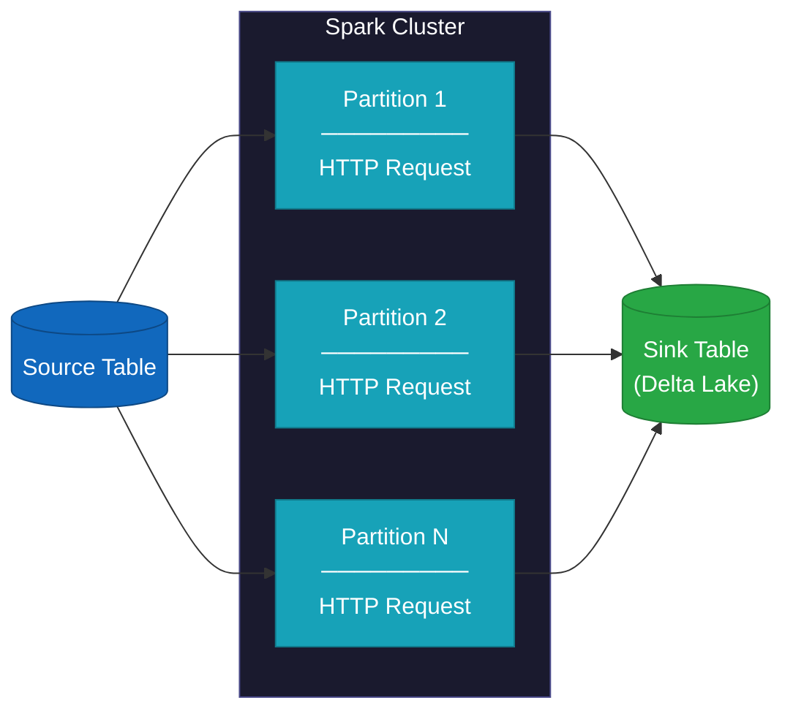
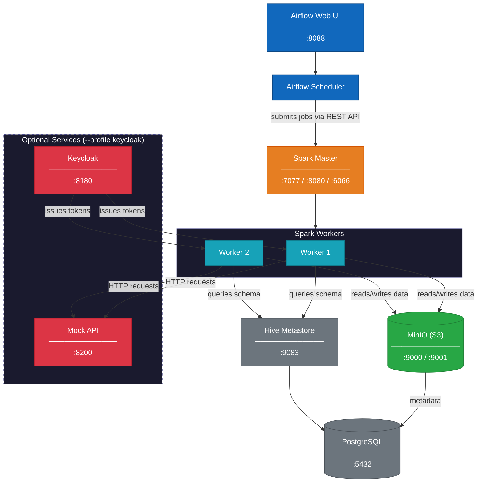

# Spark API-Driven ETL Framework

## Overview
Sending millions of rows to a REST API is deceptively hard in distributed compute platforms like Spark. A naive driver-only loop does not scale. Multithreaded workers using synchronous `requests` waste memory on idle OS threads. Refreshing OAuth2 tokens becomes a challenge due to broadcast variable limitations or hitting token checkout limits on the host server.

This framework solves all of that. It's a production-grade, configuration-driven Spark ETL application that distributes HTTP requests across a Spark cluster, achieves concurrency within each worker via `asyncio` and `aiohttp`, and manages long-lived authentication with a driver-side OAuth2 RPC service that keeps tokens fresh across every worker for the lifetime of the job.

The framework runs on a fully containerized local platform orchestrated with Docker Compose — a Spark cluster with multiple workers, Delta Lake storage backed by MinIO, a Hive Metastore, Airflow for job orchestration, Keycloak for OAuth2, and a mock API server. Clone the repo, run two commands, and the entire platform is live. Pipelines can be triggered via Airflow DAGs, Jupyter notebooks, or the CLI.

Pipelines are defined entirely in YAML or JSON — endpoint, authentication strategy, middleware, and source/sink tables — and validated at startup with Pydantic before a single Spark job is submitted. Adding a new pipeline requires no code changes.

## How It Works
Each row in a source table becomes a parameterized HTTP request. The framework partitions the source data across Spark workers, where each partition processes its rows concurrently using an asyncio producer-consumer queue. Responses are collected and written to a Delta Lake sink table alongside request metadata, status codes, and error details.



## Key Features

* **Spark-native execution** - Distributes API requests across workers via `mapPartitions`
* **Configuration-driven** - Define pipelines in YAML with strict Pydantic validation
* **Multiple auth patterns** - None, Basic, Bearer, OAuth2 (password & client credentials)
* **Pluggable middleware** - Retries, logging, timing, auth injection, request mutation
* **Idempotent processing** - Track requests with IDs for fault-tolerant execution
* **Worker-side execution** - Fully serialized runtime behavior for Spark safety

## Quick Start

```bash
# 1. Build Docker images
make build-demo

# 2. Start the platform
make up-demo

# 3. Wait for services (~60-90s for all health checks)
make ps
```

## Running Pipelines

### Via Airflow UI

1. Open http://localhost:8088 (admin/admin)
2. Find `demo_all_pipelines_parallel` (runs all demos in parallel)
3. Toggle the DAG to "On" and click the play button

### Via Airflow CLI

```bash
# Unpause and trigger the parallel demo
docker compose -f docker/docker-compose.yml exec airflow-webserver \
  airflow dags unpause demo_all_pipelines_parallel

docker compose -f docker/docker-compose.yml exec airflow-webserver \
  airflow dags trigger demo_all_pipelines_parallel

# Monitor status
docker compose -f docker/docker-compose.yml exec airflow-webserver \
  airflow dags list-runs -d demo_all_pipelines_parallel
```

Results land in Delta tables viewable via the Spark SQL shell or MinIO console

### Via Jupyter Notebooks

1. Open http://localhost:8888 (token: `jupyter`)
2. Navigate to `notebooks/` and open any demo notebook
3. Run all cells to execute the pipeline

### Programmatic Usage

```python
from pipeline import run_pipeline

run_pipeline(
    spark=spark,
    config_path="configs/example_pipeline.yaml",
    source_df=None,  # or provide a DataFrame
)
```

## Documentation

Start here if you want to understand the design:

| Document | Description |
|----------|-------------|
| [Architecture](docs/architecture.md) | **Start here.** End-to-end data flow, driver vs. worker responsibilities, and why `asyncio` outperforms multithreading at cluster scale |
| [Middleware](docs/middleware.md) | The pluggable request pipeline — how auth, retries, logging, and transforms are composed without modifying core logic |
| [Configuration](docs/configuration.md) | YAML pipeline reference — endpoints, auth strategies, middleware, and source/sink tables |
| [Transport](docs/transport.md) | HTTP engine abstraction, connection pooling, and the process-scoped session lifecycle |
| [Running Demos](docs/running-demos.md) | Step-by-step guide to running all five auth pattern demos |
| [Local Development](docs/local-development.md) | Full platform reference — Docker services, Makefile commands, ports, and credentials |
| [Spark REST API](docs/spark-rest-api-configuration.md) | How Airflow submits jobs to Spark in cluster mode without `SparkSubmitOperator` |

## Platform Architecture



## Who This Is For

This framework is built for data engineers working with APIs at scale — where a single requests.get() in a loop stopped being acceptable long ago, but the right distributed solution isn't obvious.

It fits naturally as the bronze layer of an API-sourced pipeline: each row in a source table becomes a parameterized HTTP request, and each response lands in a Delta table ready for downstream transformation. The framework handles the hard parts — cluster-wide concurrency, token lifecycle management, partial failure recovery, and idempotent re-execution — so pipeline authors only need to write YAML.

If your data lives behind a REST API and you need to move it into a lakehouse reliably and at scale, this is the pattern.

## License

MIT
