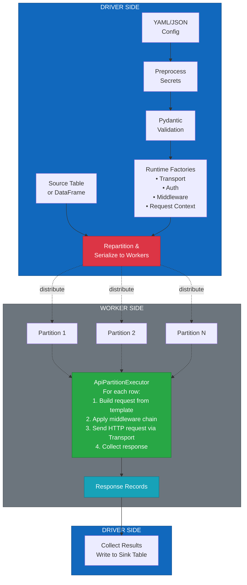
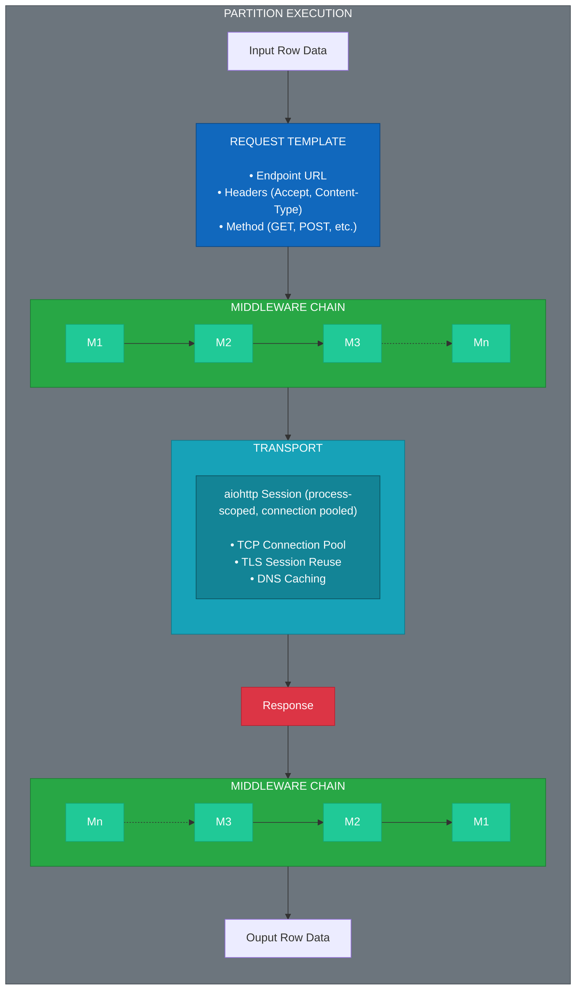
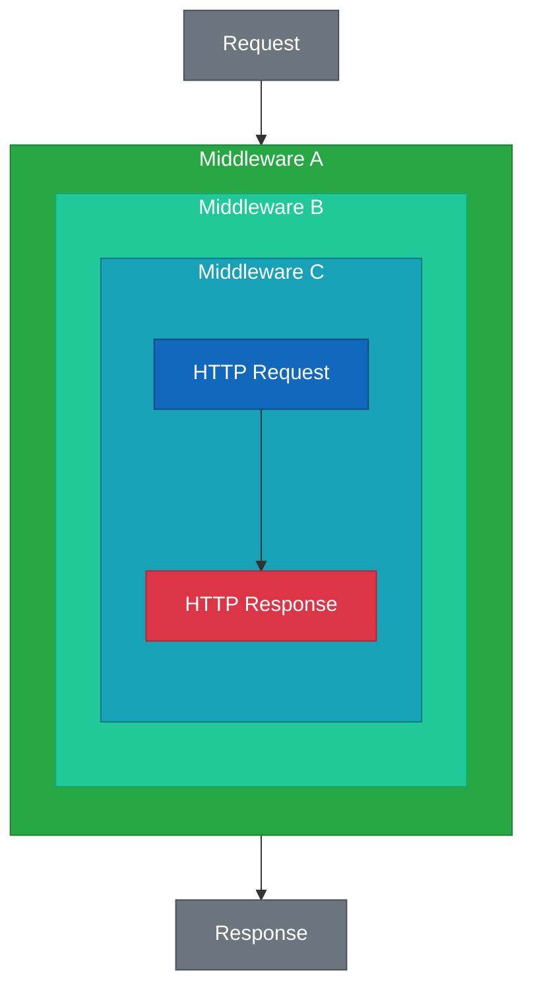

# Architecture

This document describes the high-level architecture of the Spark API-Driven ETL Framework.

## Overview

The framework is designed around three distinct layers:

| Layer   | Responsibility                    |
| ------- | --------------------------------- |
| Config  | Declarative pipeline definition   |
| Control | Validation, wiring, orchestration |
| Runtime | Executed on Spark workers         |

## Pipeline Flow

## Worker-Side Execution Detail

Each Spark partition executes the following flow:

## Middleware Execution Order

Middleware is executed in the order it is configured, wrapping each subsequent middleware:

This allows middleware to run logic **before and/or after** the HTTP request.

## Design Principles

### 1. Spark Safety

* No SparkContext on workers
* Only serializable factories are shipped

### 2. Idempotency First

* Every row carries a `request_id`
* Designed for merge-friendly downstream tables

### 3. Compile, Then Run

* Config is preprocessed, validated, and *compiled* on the driver
* Workers execute only runtime logic

### 4. Clear Abstractions

* Config ≠ Control ≠ Runtime
* Each layer has a single responsibility

### 5. Minimal Magic

* Explicit wiring
* No hidden global state
* No runtime config mutation

### 6. Middleware-Driven Extensibility

* Request behavior is modified via middleware, not hard-coded logic
* Middleware is composable, reusable, and ordered
* New functionality is added without changing the executor or transport layers
