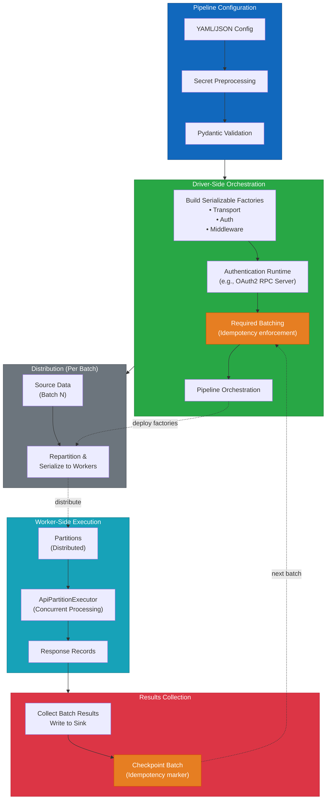
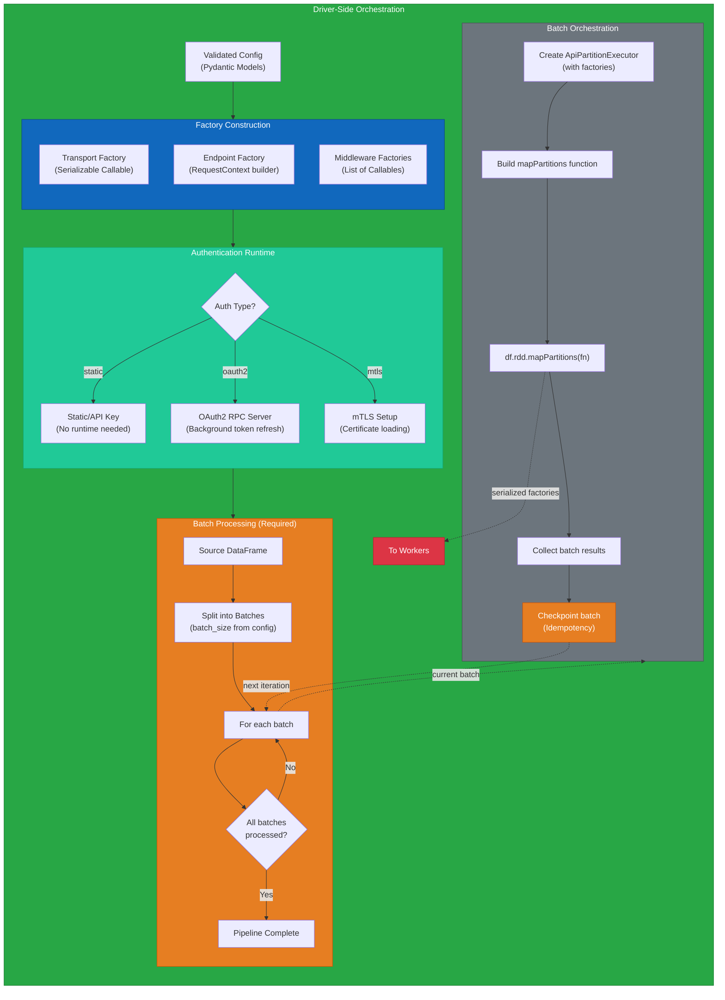
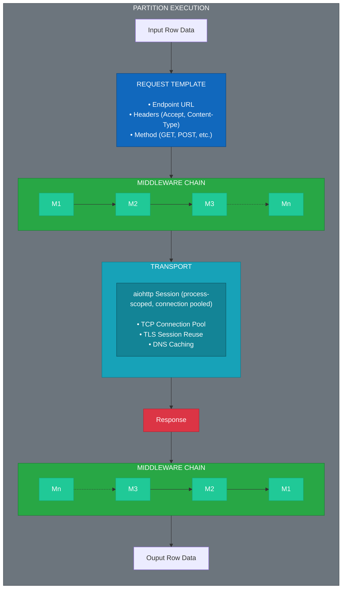
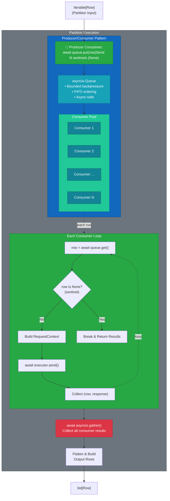
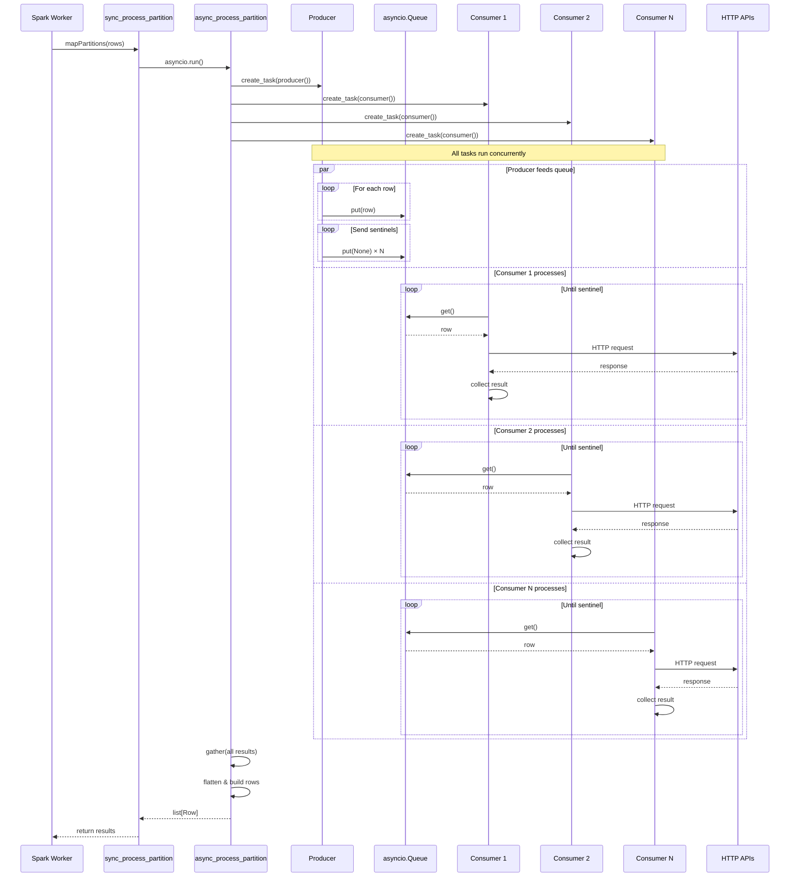
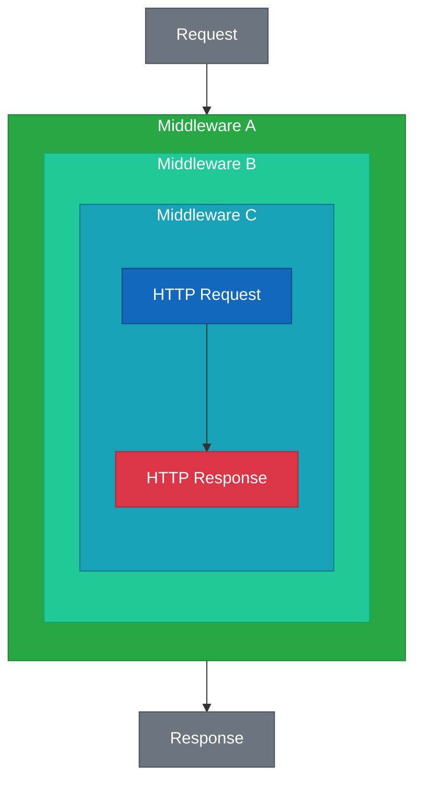

# Architecture
This document describes the high-level architecture of the Spark API-Driven ETL Framework. 

## Overview
Performing parallel and concurrent HTTP requests to RESTful API endpoints in Spark is not trivial due to challenges around managing distributed compute architecture. Most implementations use suboptimal approaches:

* **Driver-only requests** — defeats Spark's parallelism and does not scale for large datasets
* **Multithreading with `requests` library** — achieves concurrency but uses blocking I/O, substantially increasing time between requests

This design maximizes API request throughput by layering concurrency at multiple levels:

1) **Cluster-level parallelism**: Spark distributes partitions across worker nodes
2) **Partition-level concurrency**: asyncio.Queue enables concurrent processing of multiple rows within each partition with backpressure control
3) **Request-level concurrency**: aiohttp's non-blocking I/O allows the event loop to handle multiple in-flight HTTP requests simultaneously on each worker

The framework supports common HTTP authentication mechanisms, including OAuth2.0 and mTLS. Request/response processing is handled through a **middleware layer** for payload transformation and a **transport layer** for HTTP execution.

The framework is organized into three architectural layers:

| Layer            | Responsibility                                                                 |
| ---------------- | ------------------------------------------------------------------------------ |
| Pipeline Config  | Declarative pipeline definition via YAML/JSON with Pydantic validation         |
| Driver-side      | Orchestration, batching, driver-side authentication, and resource distribution |
| Executor-side    | Concurrent request execution, middleware processing, worker-side authentication|

### Batch Processing and Idempotency

All pipelines process data in configurable batches (default: 10000 rows). This design choice enforces idempotency:

- **Checkpoint tracking**: Each batch completion is recorded, enabling safe pipeline restarts
- **Partial failure recovery**: Failed batches can be retried without reprocessing successful ones
- **Memory management**: Bounded batch sizes prevent executor memory exhaustion
- **Progress visibility**: Batch-level metrics provide granular execution monitoring

Larger batches reduce overhead but increase memory usage and retry cost. Smaller batches provide finer-grained checkpointing at the cost of more Spark actions.

### Key Design Principles

- **Factory-based composition**: All components (transport, auth, middleware) are instantiated via serializable factories, ensuring they work across Spark's distributed boundaries
- **Extensible design**: Abstract interfaces and dependency injection enable custom authentication, middleware, and transport implementations without modifying framework code
- **Process-scoped resources**: HTTP sessions and connections are reused across partition executions on the same worker for efficiency
- **Separation of concerns**: Authentication, retry logic, logging, and transport are decoupled through middleware layers
- **Idempotency**: Required batch processing with checkpointing ensures pipeline resilience and safe re-execution after failures

### Architecture Diagrams

The following sections provide visual representations of the framework:
- **[Driver-Side Execution](#driver-side-exectuion)** - Driver → Workers → Response collection
- **[Worker-Side Exectuion](#worker-side-execution)** - Row processing, middleware, and transport
- **[Concurrent Request Processing](#concurrent-request-processing)** - Producer/consumer pattern with `asyncio.Queue`
- **[Middleware Pipeline](#middleware-pipeline)** - Injector pattern middleware pipeline

### When to Use This Framework

This framework is ideal for:
- **High-volume API ingestion**: Processing millions of records requiring individual API calls
- **Rate-limited APIs**: Backpressure control prevents overwhelming API endpoints
- **Long-running pipelines**: OAuth2 token refresh and session management for jobs exceeding token lifetimes
- **Complex authentication**: Built-in support for OAuth2, mTLS, and custom auth patterns

**Not recommended for:**
- Systems with native Spark connectors (BigQuery, Snowflake, Kafka) - use the connector instead
- APIs offering bulk export files (CSV/Parquet downloads) - download directly
- Single-request extractions - Python `requests` library is simpler
- APIs with per-second rate limits incompatible with any concurrency

## Pipeline Flow


### Driver-Side Execution


### Worker-Side Execution

Each Spark partition executes the following flow:



## Concurrent Request Processing

The `ApiPartitionExecutor` uses an **asyncio producer-consumer pattern** with bounded concurrency to process partition rows in parallel, rather than sequentially.

### Row-level concurrency
The following diagram shows the structural components and data flow:

**Key Components:**

- **Producer**: Feeds rows from the partition iterator into the queue, then sends sentinel values (`None`) to signal completion
- **Queue**: Provides backpressure and ensures thread-safe communication between producer and consumers
- **Consumer Pool**: `concurrency_limit` (default 20) concurrent workers that pull rows, execute requests, and collect responses
- **Gather**: Waits for all consumers to complete and combines their results

### Row Processing Execution Timeline

The following sequence diagram shows how these components interact over time:


**Execution Flow:**

1. **Initialization**: Spark calls the synchronous wrapper which starts the async event loop
2. **Task Creation**: Producer and N consumer tasks are created and scheduled concurrently
3. **Parallel Execution**: 
   - Producer feeds rows into the queue as fast as consumers can process
   - Consumers pull rows, make HTTP requests, and collect responses independently
   - The queue provides natural backpressure when consumers are slower than the producer
4. **Completion**: Producer sends sentinel values; consumers exit when they receive sentinels
5. **Collection**: All consumer results are gathered, flattened, and returned to Spark

### Performance Benefits

With `concurrency_limit=20`, a partition of 1000 rows can process up to 20 HTTP requests simultaneously rather than sequentially. This can result in **10-20x throughput improvement** for I/O-bound API calls, with the actual speedup depending on:

- API response times
- Network latency
- Rate limits on the target API
- Available system resources

The concurrency limit prevents overwhelming the target API while maximizing throughput within safe bounds.


## Async `aiohttp` vs Multithreaded `requests`

In many distributed HTTP ingestion pipelines built on Spark, concurrency within a
worker task is achieved by pairing `ThreadPoolExecutor` with the `requests` library.
This approach works, but it comes with compounding costs that become significant at
cluster scale.

### Blocking vs Non-Blocking I/O

`requests` is a synchronous library. When a thread calls `requests.get()` or
`requests.post()`, it issues a blocking system call and suspends until the OS
delivers the network response. During this waiting period, the thread is not doing any 
useful work; it is simply occupying memory and a slot in the OS scheduler. Other threads
can still run and issue their own requests during this time, which is how concurrency
is achieved, but each in-flight request must hold an OS thread for its entire
duration: connection establishment, request transmission, server processing time, and
response receipt.

`aiohttp` is built on non-blocking sockets and Python's `asyncio` event loop. Rather
than suspending an OS thread, a coroutine calling `await session.get()` registers
interest in the socket with the event loop and immediately yields control. The single
event loop thread is then free to drive other coroutines forward — issuing new
requests, processing completed responses, all without any additional threads. When the OS
signals that data has arrived on a socket, the event loop resumes the appropriate
coroutine from exactly where it yielded. Coroutine switching is a function call in
user space and carries none of the overhead of an OS context switch.

### Sequential Walkthrough: One Request Lifecycle

#### `requests` + `ThreadPoolExecutor`

1. `ThreadPoolExecutor` assigns the row to an available thread from the pool
2. The thread constructs the HTTP request (headers, body, URL)
3. The thread calls `requests.get()`, which calls the OS `send()` system call
4. The OS transmits the request and marks the thread as **blocked**, waiting on the socket
5. The OS context switches to another thread — saving and restoring CPU registers,
   flushing pipeline state
6. Eventually the server responds; the OS receives data on the socket and marks the
   thread as **runnable** again
7. The OS schedules the thread back onto a CPU core (another context switch)
8. The thread reads the response body, parses it, and returns the result
9. The thread returns to the pool, available for the next row

At step 4, the thread is suspended but still consumes its full stack allocation. 
Thread stacks typically reserve several MB of virtual address space per thread
(~8MB is common on Linux). While not all of this becomes resident immediately,
160 threads per worker node still create substantial memory overhead that reduces
the pool available to Spark for execution and caching.

Step 5 involves saving and restoring CPU registers, updating memory mapping tables, 
and flushing cached state (a process that takes microseconds per switch, compared to 
the sub-microsecond cost of switching between coroutines in user space).

At step 6, if many requests complete around the same time,
many threads transition from blocked to runnable simultaneously. The OS must schedule
all of them, causing a burst of context switches and a spike in CPU scheduler activity.
This *thundering herd* effect can produce uneven request pacing and momentary latency
spikes downstream.

#### `aiohttp` + `asyncio`

1. The producer coroutine places a row onto the `asyncio.Queue`
2. A consumer coroutine dequeues the row and constructs the HTTP request
3. The coroutine calls `await session.get()`, which registers the socket with the
   event loop's I/O selector (e.g., `epoll` on Linux) and **yields control**
4. The event loop immediately picks up another ready coroutine — no OS call, no
   register save, no cache flush (~100ns)
5. The OS monitors all registered sockets with a single `epoll_wait()` system call
6. When the server responds, `epoll` notifies the event loop
7. The event loop resumes the coroutine from exactly where it yielded
8. The coroutine reads the response body, parses it, and places the result in the
   output list
9. The coroutine loops back to dequeue the next row

At step 3, coroutine frames consume KB-scale memory compared to the MB-scale reservation
of OS thread stacks — roughly three orders of magnitude less overhead.

At step 6, all ready sockets are reported in a single `epoll`
notification batch, so the event loop processes completions sequentially and calmly
rather than in a burst. Requests are dispatched and completed at a steady pace,
naturally smoothing the load seen by the downstream API.

### Why This Matters in Spark

Spark runs one executor task per available core on each worker node. Because each task
runs in its own Python process, thread counts multiply across the node:
```
total OS threads per node = (tasks per node) × (threadpool size per task)
```

On a node with 8 cores and a threadpool size of 20, this is 160 OS threads competing
for 8 cores — a 20:1 thread-to-core ratio. Each idle thread still consumes ~8MB of
stack space, so thread stacks alone can account for over 1GB of memory per worker
node, memory that would otherwise be available to Spark for shuffle buffers, caching,
and JVM heap.

With `aiohttp`, the thread count for concurrent HTTP I/O remains constant at roughly
one per executor task — 8 threads on an 8-core worker node, rather than 160.
Concurrency within each task is expressed as lightweight coroutines entirely
in user space, adding negligible memory overhead and no scheduler pressure. This ratio
holds regardless of how large `concurrency_limit` is set: increasing from 20 to 100
concurrent requests adds 80 coroutines each with a memory footprint in the KB range,
rather than 80 OS threads each in the MB range.

The practical effect is that `aiohttp`-based workers scale predictably as cluster
parallelism increases, while `requests`-based workers accumulate OS-level overhead
that compounds with every additional executor task on the node.

At scale, thread stack memory accumulates across executor processes on each worker
node, reducing the memory available to Spark's execution pool. Under high response
payloads, this memory pressure can trigger partition spill to disk — a far more
costly outcome than scheduling overhead alone — while aiohttp's coroutine-based
model keeps memory overhead negligible regardless of concurrency level, preserving
Spark's full memory budget for execution and caching.


## Middleware Pipeline

Middleware is executed in the order it is configured, wrapping each subsequent middleware:



This allows middleware to run logic **before and/or after** the HTTP request.
