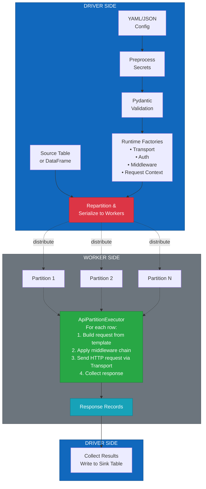

# Architecture

This document describes the high-level architecture of the Spark API-Driven ETL Framework.

## Overview

The framework is designed around three distinct layers:

| Layer   | Responsibility                    |
| ------- | --------------------------------- |
| Config  | Declarative pipeline definition   |
| Control | Validation, wiring, orchestration |
| Runtime | Executed on Spark workers         |

## Pipeline Flow



## Worker-Side Execution Detail

Each Spark partition executes the following flow:

```
┌─────────────────────────────────────────────────────────────────────────────┐
│                        PARTITION EXECUTION                                  │
├─────────────────────────────────────────────────────────────────────────────┤
│                                                                             │
│  ┌──────────────┐                                                          │
│  │   Row Data   │                                                          │
│  └──────┬───────┘                                                          │
│         │                                                                   │
│         ▼                                                                   │
│  ┌──────────────────────────────────────────────────────────────────────┐  │
│  │                      REQUEST TEMPLATE                                 │  │
│  │   • Base URL + Path                                                   │  │
│  │   • Headers (Accept, Content-Type)                                    │  │
│  │   • Method (GET, POST, etc.)                                          │  │
│  └──────────────────────────────────────────────────────────────────────┘  │
│         │                                                                   │
│         ▼                                                                   │
│  ┌──────────────────────────────────────────────────────────────────────┐  │
│  │                      MIDDLEWARE CHAIN                                 │  │
│  │                                                                       │  │
│  │   ┌────────────┐   ┌────────────┐   ┌────────────┐   ┌────────────┐  │  │
│  │   │   Auth     │──▶│   Retry    │──▶│  Logging   │──▶│   Timing   │  │  │
│  │   │ Injection  │   │   Logic    │   │            │   │            │  │  │
│  │   └────────────┘   └────────────┘   └────────────┘   └────────────┘  │  │
│  │                                                                       │  │
│  └──────────────────────────────────────────────────────────────────────┘  │
│         │                                                                   │
│         ▼                                                                   │
│  ┌──────────────────────────────────────────────────────────────────────┐  │
│  │                         TRANSPORT                                     │  │
│  │                                                                       │  │
│  │   ┌─────────────────────────────────────────────────────────────┐    │  │
│  │   │  aiohttp Session (process-scoped, connection pooled)        │    │  │
│  │   │                                                              │    │  │
│  │   │   • TCP Connection Pool                                      │    │  │
│  │   │   • TLS Session Reuse                                        │    │  │
│  │   │   • DNS Caching                                              │    │  │
│  │   └─────────────────────────────────────────────────────────────┘    │  │
│  │                                                                       │  │
│  └──────────────────────────────────────────────────────────────────────┘  │
│         │                                                                   │
│         ▼                                                                   │
│  ┌──────────────┐                                                          │
│  │   Response   │ ──▶  status_code, headers, body, timing, metadata        │
│  └──────────────┘                                                          │
│                                                                             │
└─────────────────────────────────────────────────────────────────────────────┘
```

## Middleware Execution Order

Middleware is executed in the order it is configured, wrapping each subsequent middleware:

```
                    ┌─────────────────────────────────────┐
  Request ─────────▶│           Middleware A              │
                    │  ┌───────────────────────────────┐  │
                    │  │        Middleware B           │  │
                    │  │  ┌─────────────────────────┐  │  │
                    │  │  │     Middleware C        │  │  │
                    │  │  │  ┌───────────────────┐  │  │  │
                    │  │  │  │   HTTP Request    │  │  │  │
                    │  │  │  │    (Transport)    │  │  │  │
                    │  │  │  └─────────┬─────────┘  │  │  │
                    │  │  │            │            │  │  │
                    │  │  │  ┌─────────▼─────────┐  │  │  │
                    │  │  │  │   HTTP Response   │  │  │  │
                    │  │  │  └───────────────────┘  │  │  │
                    │  │  └─────────────────────────┘  │  │
                    │  └───────────────────────────────┘  │
                    └──────────────────┬──────────────────┘
                                       │
  Response ◀───────────────────────────┘
```

This allows middleware to run logic **before and/or after** the HTTP request.

## Design Principles

### 1. Spark Safety

* No SparkContext on workers
* Only serializable factories are shipped

### 2. Idempotency First

* Every row carries a `request_id`
* Designed for merge-friendly downstream tables

### 3. Compile, Then Run

* Config is preprocessed, validated, and *compiled* on the driver
* Workers execute only runtime logic

### 4. Clear Abstractions

* Config ≠ Control ≠ Runtime
* Each layer has a single responsibility

### 5. Minimal Magic

* Explicit wiring
* No hidden global state
* No runtime config mutation

### 6. Middleware-Driven Extensibility

* Request behavior is modified via middleware, not hard-coded logic
* Middleware is composable, reusable, and ordered
* New functionality is added without changing the executor or transport layers
