# Architecture
This document describes the high-level architecture of the Spark API-Driven ETL Framework. 

## Overview
Performing parallel and concurrent HTTP requests to RESTful API endpoints in Spark is not trivial due to challenges around managing distributed compute architecture. Most implementations use suboptimal approaches:

* **Driver-only requests** — defeats Spark's parallelism and does not scale for large datasets
* **Multithreading with `requests` library** — achieves concurrency but uses blocking I/O, substantially increasing time between requests

This design maximizes API request throughput by layering concurrency at multiple levels:

1) **Cluster-level parallelism**: Spark distributes partitions across worker nodes
2) **Partition-level concurrency**: asyncio.Queue enables concurrent processing of multiple rows within each partition with backpressure control
3) **Request-level concurrency**: aiohttp's non-blocking I/O allows the event loop to handle multiple in-flight HTTP requests simultaneously on each worker

The framework supports common HTTP authentication mechanisms, including OAuth2.0 and mTLS. Request/response processing is handled through a **middleware layer** for payload transformation and a **transport layer** for HTTP execution.

The framework is organized into three architectural layers:

| Layer            | Responsibility                                                                 |
| ---------------- | ------------------------------------------------------------------------------ |
| Pipeline Config  | Declarative pipeline definition via YAML/JSON with Pydantic validation         |
| Driver-side      | Orchestration, batching, driver-side authentication, and resource distribution |
| Executor-side    | Concurrent request execution, middleware processing, worker-side authentication|

### Batch Processing and Idempotency

All pipelines process data in configurable batches (default: 10000 rows). This design choice enforces idempotency:

- **Checkpoint tracking**: Each batch completion is recorded, enabling safe pipeline restarts
- **Partial failure recovery**: Failed batches can be retried without reprocessing successful ones
- **Memory management**: Bounded batch sizes prevent executor memory exhaustion
- **Progress visibility**: Batch-level metrics provide granular execution monitoring

Larger batches reduce overhead but increase memory usage and retry cost. Smaller batches provide finer-grained checkpointing at the cost of more Spark actions.

### Key Design Principles

- **Factory-based composition**: All components (transport, auth, middleware) are instantiated via serializable factories, ensuring they work across Spark's distributed boundaries
- **Extensible design**: Abstract interfaces and dependency injection enable custom authentication, middleware, and transport implementations without modifying framework code
- **Process-scoped resources**: HTTP sessions and connections are reused across partition executions on the same worker for efficiency
- **Separation of concerns**: Authentication, retry logic, logging, and transport are decoupled through middleware layers
- **Idempotency**: Required batch processing with checkpointing ensures pipeline resilience and safe re-execution after failures

### Architecture Diagrams

The following sections provide visual representations of the framework:
- **[Driver-Side Execution](#driver-side-exectuion)** - Driver → Workers → Response collection
- **[Worker-Side Exectuion](#worker-side-execution)** - Row processing, middleware, and transport
- **[Concurrent Request Processing](#concurrent-request-processing)** - Producer/consumer pattern with `asyncio.Queue`
- **[Middleware Pipeline](#middleware-pipeline)** - Injector pattern middleware pipeline

### When to Use This Framework

This framework is ideal for:
- **High-volume API ingestion**: Processing millions of records requiring individual API calls
- **Rate-limited APIs**: Backpressure control prevents overwhelming API endpoints
- **Long-running pipelines**: OAuth2 token refresh and session management for jobs exceeding token lifetimes
- **Complex authentication**: Built-in support for OAuth2, mTLS, and custom auth patterns

**Not recommended for:**
- Systems with native Spark connectors (BigQuery, Snowflake, Kafka) - use the connector instead
- APIs offering bulk export files (CSV/Parquet downloads) - download directly
- Single-request extractions - Python `requests` library is simpler
- APIs with per-second rate limits incompatible with any concurrency

## Pipeline Flow

### Driver-Side Execution

### Worker-Side Execution

Each Spark partition executes the following flow:

```mermaid
flowchart TB
    subgraph partition["PARTITION EXECUTION"]
        direction TB
        
        rowin["Input Row Data"]
        rowout["Ouput Row Data"]
        
        template["REQUEST TEMPLATE<br/><br/>• Endpoint URL<br/>• Headers (Accept, Content-Type)<br/>• Method (GET, POST, etc.)"]
        
        subgraph middleware1["MIDDLEWARE CHAIN"]
            direction LR
            M11["M1"]
            M21["M2"]
            M31["M3"]
            MN1["Mn"]

            M11 --> M21 --> M31 -.-> MN1
        end
        
        subgraph transport["TRANSPORT"]
            direction TB
            session["aiohttp Session (process-scoped, connection pooled)<br/><br/>• TCP Connection Pool<br/>• TLS Session Reuse<br/>• DNS Caching"]
        end
        
        response["Response"]

        subgraph middleware2["MIDDLEWARE CHAIN"]
            direction LR
            M12["M1"]
            M22["M2"]
            M32["M3"]
            MN2["Mn"]

            MN2 -.-> M32 --> M22 --> M12
        end
        
        rowin --> template --> middleware1 --> transport --> response --> middleware2 --> rowout
    end
    
    style partition fill:#6c757d,stroke:#495057,color:#fff
    style template fill:#1168bd,stroke:#0d4884,color:#fff
    style middleware1 fill:#28a745,stroke:#1e7e34,color:#fff
    style M11 fill:#20c997,stroke:#17a673,color:#fff
    style M21 fill:#20c997,stroke:#17a673,color:#fff
    style M31 fill:#20c997,stroke:#17a673,color:#fff
    style MN1 fill:#20c997,stroke:#17a673,color:#fff
    style middleware2 fill:#28a745,stroke:#1e7e34,color:#fff
    style M12 fill:#20c997,stroke:#17a673,color:#fff
    style M22 fill:#20c997,stroke:#17a673,color:#fff
    style M32 fill:#20c997,stroke:#17a673,color:#fff
    style MN2 fill:#20c997,stroke:#17a673,color:#fff
    style transport fill:#17a2b8,stroke:#117a8b,color:#fff
    style session fill:#138496,stroke:#0c5460,color:#fff
    style response fill:#dc3545,stroke:#bd2130,color:#fff
```

## Concurrent Request Processing

The `ApiPartitionExecutor` uses an **asyncio producer-consumer pattern** with bounded concurrency to process partition rows in parallel, rather than sequentially.

### Row-level concurrency
The following diagram shows the structural components and data flow:

**Key Components:**

- **Producer**: Feeds rows from the partition iterator into the queue, then sends sentinel values (`None`) to signal completion
- **Queue**: Provides backpressure and ensures thread-safe communication between producer and consumers
- **Consumer Pool**: `concurrency_limit` (default 20) concurrent workers that pull rows, execute requests, and collect responses
- **Gather**: Waits for all consumers to complete and combines their results

### Row Processing Execution Timeline

The following sequence diagram shows how these components interact over time:

**Execution Flow:**

1. **Initialization**: Spark calls the synchronous wrapper which starts the async event loop
2. **Task Creation**: Producer and N consumer tasks are created and scheduled concurrently
3. **Parallel Execution**: 
   - Producer feeds rows into the queue as fast as consumers can process
   - Consumers pull rows, make HTTP requests, and collect responses independently
   - The queue provides natural backpressure when consumers are slower than the producer
4. **Completion**: Producer sends sentinel values; consumers exit when they receive sentinels
5. **Collection**: All consumer results are gathered, flattened, and returned to Spark

### Performance Benefits

With `concurrency_limit=20`, a partition of 1000 rows can process up to 20 HTTP requests simultaneously rather than sequentially. This can result in **10-20x throughput improvement** for I/O-bound API calls, with the actual speedup depending on:

- API response times
- Network latency
- Rate limits on the target API
- Available system resources

The concurrency limit prevents overwhelming the target API while maximizing throughput within safe bounds.

## Async `aiohttp` vs Multithreaded `request`

In many distributed HTTP request Spark applications, concurrency is achieved on the Spark worker by pairing multithreading with the `requests` library. However, because the `request` library is synchronous, it creates an I/O blocking condition during each request in which subsequent requests are required to wait until the current process has been completed. I/O blocking causes two unintended problems with this implementation: 

1) thread blocking I/O prevents all other threads from staging the request, forcing iterative processing when concurrent processing is intended
2) adds overhead by the OS due to context switching between threads.

A multithreaded `requests` design performs the following operations:
1) Each thread is assigned an available connection from the connection pool. Unassigned threads wait for a connection in the pool to become available.
2) The active thread blocks the I/O while waiting for an HTTP response.
3) Once the thread receives the response, the I/O is unblocked and the OS must contextually switch to the next thread that has an assigned connection.

In contrast, the `aiohttp` library allows for asynchronous, single threaded, non-blocking I/O processes:
1) Coroutines are assigned available connections from the connection pool.
2) a coroutine makes a request and yields while waiting for the HTTP response, it does not block the I/O for other coroutines.
3) The event loop switches between coroutines without OS context switching -- coroutines switching is handled by the python application.

In a standard application, the overhead introduced by multithreading is relatively small so there is no significant benefit to using `aiohttp` over `requests`. Howeer, in the context of a Spark cluster, where the number of Python processes scale with the number of CPUs assigned to the node, the added latency due to context switching between threads can be substantially large.

```mermaid
flowchart TB
  %% Async aiohttp design on ONE Spark worker node
  %% N = concurrent task slots (cores)
  %% M = coroutine concurrency per task (consumers)

  %% ---------- Styling (hex colors for GitHub Mermaid) ----------
  %% Use light fills + strong strokes; generally readable in light/dark themes.
  classDef spark   fill:#EEF2FF,stroke:#4F46E5,stroke-width:2px,color:#111111;
  classDef process fill:#ECFDF5,stroke:#10B981,stroke-width:2px,color:#111111;
  classDef asyncio fill:#EFF6FF,stroke:#2563EB,stroke-width:2px,color:#111111;
  classDef queue   fill:#FFFBEB,stroke:#EAB308,stroke-width:2px,color:#111111;
  classDef coro    fill:#FFF1F2,stroke:#E11D48,stroke-width:2px,color:#111111;
  classDef http    fill:#F5F3FF,stroke:#7C3AED,stroke-width:2px,color:#111111;
  classDef api     fill:#F1F5F9,stroke:#64748B,stroke-width:2px,color:#111111;

  %% ---------- Diagram ----------
  subgraph Node["Spark Worker Node (VM)"]
    direction TB
    Spark["Spark Executor(s) on node\nTotal task slots = N (cores)"]:::spark

    subgraph Slots["Concurrent Task Slots (N)"]
      direction LR

      subgraph Task1["Task Slot 1 → Python Worker Process 1"]
        direction TB
        TaskProc1["Python worker process"]:::process
        Loop1["asyncio Event Loop<br>(1 OS thread)"]:::asyncio
        P1["Producer coroutine<br>(enqueue rows)"]:::coro
        Q1["asyncio.Queue<br>(rows / backpressure)"]:::queue
        C1["M Consumer coroutines<br>(concurrency = M)"]:::coro
        S1["aiohttp.ClientSession<br>(conn pool + non-blocking sockets)"]:::http

        TaskProc1 --> Loop1 --> P1 --> Q1 --> C1 --> S1
      end

      subgraph Task2["Task Slot 2 → Python Worker Process 2"]
        direction TB
        TaskProc2["Python worker process"]:::process
        Loop2["asyncio Event Loop<br>(1 OS thread)"]:::asyncio
        P2["Producer coroutine"]:::coro
        Q2["asyncio.Queue"]:::queue
        C2["M Consumer coroutines"]:::coro
        S2["aiohttp.ClientSession"]:::http

        TaskProc2 --> Loop2 --> P2 --> Q2 --> C2 --> S2
      end

      subgraph TaskN["Task Slot N → Python Worker Process N"]
        direction TB
        TaskProcN["Python worker process"]:::process
        LoopN["asyncio Event Loop<br>(1 OS thread)"]:::asyncio
        PN["Producer coroutine"]:::coro
        QN["asyncio.Queue"]:::queue
        CN["M Consumer coroutines"]:::coro
        SN["aiohttp.ClientSession"]:::http

        TaskProcN --> LoopN --> PN --> QN --> CN --> SN
      end
    end

    Spark --> Task1
    Spark --> Task2
    Spark --> TaskN
  end

  API["Remote HTTP API"]:::api

  S1 --> API
  S2 --> API
  SN --> API

```

## Middleware Pipeline

Middleware is executed in the order it is configured, wrapping each subsequent middleware:

This allows middleware to run logic **before and/or after** the HTTP request.
