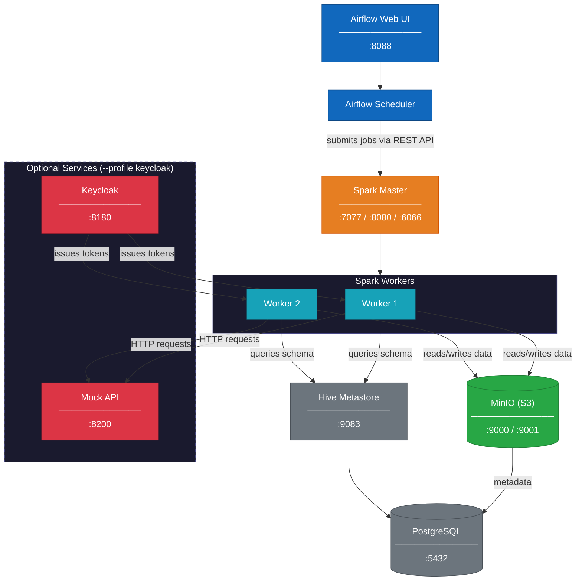

# Local Development Platform

This project includes a fully containerized local development environment managed by Docker Compose. The platform replicates a production-like data engineering stack, allowing you to develop, test, and debug ETL pipelines locally before deploying to a cloud environment such as Databricks.

All services are defined in `docker/docker-compose.yml` and orchestrated through the `Makefile`.

## Prerequisites

- Docker and Docker Compose V2
- `direnv` (optional, for automatic environment variable loading from `.envrc`)
- GNU Make

## Platform Architecture

The platform is composed of four layers: **infrastructure**, **catalog**, **compute**, and **orchestration**, with optional services for development and diagnostics.




## Service Reference

### Infrastructure Services

| Service | Image | Container | Ports | Purpose |
|---------|-------|-----------|-------|---------|
| `postgres` | `postgres:15-alpine` | `postgres` | 5432 | Shared relational database for Hive Metastore catalog and Airflow metadata |
| `minio` | `minio/minio:latest` | `minio` | 9000 (API), 9001 (Console) | S3-compatible object store serving as the data lake for Parquet and Delta Lake files |
| `minio-init` | `minio/mc:latest` | `minio-init` | -- | One-shot container that creates `warehouse` and `spark-logs` buckets, then exits |

**PostgreSQL** hosts two databases, created by `docker/postgres/init-multiple-dbs.sh`:
- `metastore` -- Hive Metastore schema catalog
- `airflow` -- Airflow task history, DAG state, and user accounts

Connect via Docker:
```bash
docker exec -it postgres psql -U postgres
```

**MinIO** provides two interfaces: the S3 API on port 9000 (used programmatically by Spark, Hive, and Airflow) and a web console on port 9001 for browsing buckets and objects manually at `http://localhost:9001`.

### Catalog Service

| Service | Image | Container | Ports | Purpose |
|---------|-------|-----------|-------|---------|
| `hive-metastore` | `distributed-api-etl-hive:latest` | `hive-metastore` | 9083 | Schema catalog for the data lake |

**Hive Metastore** does not process data. It is a metadata service that Spark queries over Thrift (port 9083) to resolve table schemas and data file locations. The metastore persists its catalog in the `metastore` PostgreSQL database.

### Compute Services

| Service | Image | Container | Ports | Purpose |
|---------|-------|-----------|-------|---------|
| `spark-master` | `distributed-api-etl-spark:latest` | `spark-master` | 7077 (cluster), 8080 (UI), 6066 (REST API) | Spark cluster manager |
| `spark-worker` | `distributed-api-etl-spark:latest` | auto-generated | -- | Spark execution nodes (2 replicas by default) |

**Spark Master** accepts job submissions on port 7077 (RPC) or 6066 (REST API) and distributes work across workers. The web UI at `http://localhost:8080` shows active applications and worker status.

**Spark Workers** register with the master and provide CPU and memory for task execution. The number of workers is controlled by the `SPARK_WORKERS` environment variable (default: 2).

### Orchestration Services

| Service | Image | Container | Ports | Purpose |
|---------|-------|-----------|-------|---------|
| `airflow-init` | `distributed-api-etl-airflow:latest` | `airflow-init` | -- | One-shot: runs migrations and creates admin user |
| `airflow-webserver` | `distributed-api-etl-airflow:latest` | `airflow-webserver` | 8088 | Web UI for viewing and triggering DAGs |
| `airflow-scheduler` | `distributed-api-etl-airflow:latest` | `airflow-scheduler` | -- | Execution engine that monitors and runs tasks |

Access the Airflow UI at `http://localhost:8088`.

### Optional Services (Profile-gated)

| Service | Image | Ports | Profile | Purpose |
|---------|-------|-------|---------|---------|
| `spark-history-server` | `distributed-api-etl-spark:latest` | 18080 | `history` | Read-only UI for inspecting completed Spark jobs |
| `jupyter` | `distributed-api-etl-jupyter:latest` | 8888 | `jupyter` | JupyterLab for interactive development |
| `keycloak` | `quay.io/keycloak/keycloak:24.0` | 8180 | `keycloak` | OAuth2/OIDC identity provider |
| `mock-api` | `distributed-api-etl-mock-api:latest` | 8200 | `keycloak` | FastAPI mock server for testing auth patterns |

These services start only when their profile is activated.

## Data Flow

1. **Airflow scheduler** triggers a DAG task
2. The task **submits a Spark job** to the spark-master via REST API
3. Spark-master distributes work across **spark-workers**
4. Workers query **hive-metastore** to resolve table schemas
5. Workers read source data from and write results to **MinIO**
6. Hive-metastore records table metadata in **PostgreSQL**

## Startup Order

Docker Compose enforces the following dependency chain via `depends_on` with health checks:

```
postgres (healthy)
  ├── minio-init (completed) ← minio (healthy)
  │     └── hive-metastore (healthy)
  │           └── spark-master (healthy)
  │                 ├── spark-worker (×N)
  │                 ├── spark-history-server (optional)
  │                 └── jupyter (optional)
  └── airflow-init (completed)
        ├── airflow-webserver
        └── airflow-scheduler
```

## Network and Volumes

All services communicate over a single Docker bridge network (`etl-network`), which provides DNS resolution by container name.

| Volume | Purpose |
|--------|---------|
| `postgres-data` | PostgreSQL data directory |
| `minio-data` | MinIO object storage |
| `hive-warehouse` | Hive warehouse directory |
| `spark-logs` | Spark event logs |
| `airflow-logs` | Airflow task logs |

Volumes persist data across container restarts. Use `make clean-volumes` to delete all volumes.

## Port Reference

| Port | Service | URL |
|------|---------|-----|
| 5432 | PostgreSQL | `psql -h localhost -U postgres` |
| 6066 | Spark REST API | `http://localhost:6066` |
| 7077 | Spark Master | `spark://localhost:7077` |
| 8080 | Spark Master UI | `http://localhost:8080` |
| 8088 | Airflow Web UI | `http://localhost:8088` |
| 8180 | Keycloak Admin | `http://localhost:8180` |
| 8200 | Mock API | `http://localhost:8200` |
| 8888 | Jupyter | `http://localhost:8888` |
| 9000 | MinIO S3 API | `http://localhost:9000` |
| 9001 | MinIO Console | `http://localhost:9001` |
| 9083 | Hive Metastore | `thrift://localhost:9083` |
| 18080 | Spark History Server | `http://localhost:18080` |

## Default Credentials

| Service | Username | Password |
|---------|----------|----------|
| MinIO | `minioadmin` | `minioadmin` |
| Airflow | `admin` | `admin` |
| PostgreSQL | `postgres` | `postgres` |
| Jupyter | -- | Token: `jupyter` |
| Keycloak Admin | `admin` | `admin` |

## Custom Docker Images

| Image | Dockerfile | Base | Additions |
|-------|-----------|------|-----------|
| `distributed-api-etl-spark` | `docker/spark/Dockerfile` | `apache/spark:3.5.1` | Delta Lake, Hadoop AWS, Python deps |
| `distributed-api-etl-airflow` | `docker/airflow/Dockerfile` | `apache/airflow:2.8.1` | HTTP providers, requests |
| `distributed-api-etl-hive` | `docker/hive/Dockerfile` | `apache/hive:4.0.0` | PostgreSQL JDBC driver |
| `distributed-api-etl-jupyter` | `docker/jupyter/Dockerfile` | `jupyter/pyspark-notebook` | PySpark, project deps |
| `distributed-api-etl-mock-api` | `docker/mock-api/Dockerfile` | `python:3.10-alpine` | FastAPI mock server |

Build all required images with `make build`.

## Makefile Commands

### Starting Services

| Command | Description |
|---------|-------------|
| `make up` | Start all default services |
| `make up-jupyter` | Start with Jupyter |
| `make up-history` | Start with Spark History Server |
| `make up-keycloak` | Start with Keycloak and mock-api |
| `make up-demo` | Start all services for demos |
| `make up-all` | Start all services including all profiles |
| `make down` | Stop all services |
| `make restart` | Stop and start all services |

### Building Images

| Command | Description |
|---------|-------------|
| `make build` | Build all required images |
| `make build-demo` | Build all images for demos |
| `make build-spark` | Build Spark image |
| `make build-airflow` | Build Airflow image |
| `make build-hive` | Build Hive Metastore image |
| `make build-jupyter` | Build Jupyter image |
| `make build-mock-api` | Build mock API image |

### Operations

| Command | Description |
|---------|-------------|
| `make logs` | Tail logs for all services |
| `make logs SERVICE=<name>` | Tail logs for a specific service |
| `make ps` | Show running containers |
| `make shell CONTAINER=<name>` | Open bash shell in container |
| `make clean` | Stop containers and remove networks |
| `make clean-volumes` | Stop and remove all volumes |
| `make clean-all` | Full cleanup including images |

### Spark Operations

| Command | Description |
|---------|-------------|
| `make spark-shell` | Open PySpark shell |
| `make spark-submit APP=<path>` | Submit Spark job |
| `make spark-sql` | Open Spark SQL shell |

### Development

| Command | Description |
|---------|-------------|
| `make test` | Run all tests |
| `make test-unit` | Run unit tests |
| `make test-integration` | Run integration tests |
| `make lint` | Run linter |
| `make format` | Format code |
| `make typecheck` | Run type checker |
